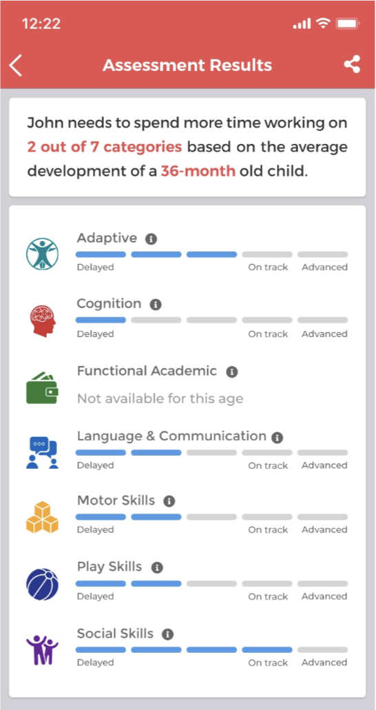

# Hello World!

**Thallos** is developing prescription digital therapeutics to advance the standard of care by enabling earlier and improved treatment of behavioral health conditions.

# Story

**"Assessment Results"** is a page where user can see results of child performance. There are seven different categories out there:

- Adaptive
- Cognition
- Functional Academic
- Language and Communication
- Motor Skills
- Play Skills
- Social Skills

## Mission

You will need to implement simple version of **"Assessment Results"** page. The page consists of 2 "cards", where first card contains short description of test results and second card contains detailed information of child performance per categorie (please refer to the image below).

**"Assessment Results"** should always contain seven categories and performance results for each of the categorie. 5 bars represent results in percentage: 1-20%, 21-40%, 41-60%, 61-80% and 81-100%. If for any reason any of categories wasn't included to "test" - "Not available for this age" status should be shown. 

In **asset** folder you can find all required components to build **"Assessment Results"**. Happy coding!

